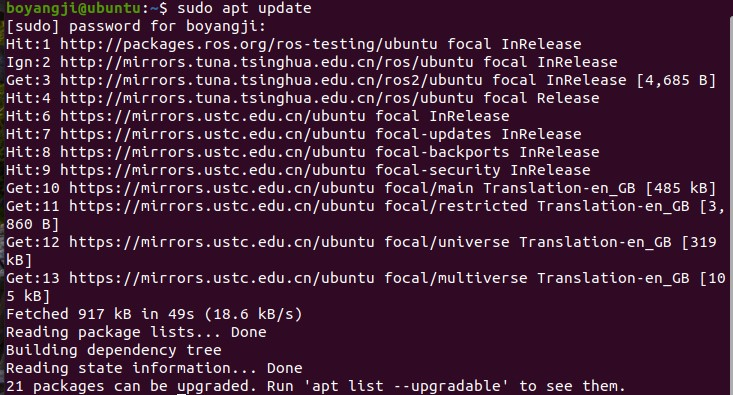

# INSTALL
## Main Scripts
* **mask_rcnn.py**  MaskRCNN takes in an image, outputs masks, boxes, labels and segmented image.
* **ur5_commander.py**  After receiving the PoseStamped message, the robotic arm moves to the specified position and performs the grasping task
* **utils.py**  Contains methods and functions that are needed for other scripts.
## Full instalation procedure
1. Install ROS Noetic:

If you have not installed ROS Noetic, please follow the URL below to do so。
```
http://wiki.ros.org/noetic/Installation/Ubuntu
```
We recommend that you install **Desktop-Full**. before installing, make sure that all your software is up to date!
```bash
sudo apt update
sudo apt upgrade
```
在这个界面输入上面的命令：



当你输入这些命令并完成更新后，你会看到这个：
（图片2）
这证明你已经完成了全部的更新

2. Setup the workspace:
```bash
mkdir -p ur5_ws/src && cd ur5_ws
```
你会看到这个界面：
（图片3）

这证明你已经完成工作区的创建并进入了工作空间，接下来请安装各种依赖。

3. Setup dependencies:
```bash
sudo apt -y install ros-noetic-moveit \
  ros-noetic-realsense2-camera \
  ros-noetic-realsense2-description \
  ros-noetic-ros-controllers
```
*Tips:
If any dependencies are missing at runtime, look up their full names and install them in the following format*
```bash
sudo apt -y install ros-noetic-<package_name>
```
举个例子：
（图片4）
因为我已经完成了所有的更新，所以界面显示数字0

继续完成接下来的操作，完成“git clone”会出现以下界面：
（图片5）
（请注意，上述图片的“git clone”只是一个例子，请不要再终端输入该命令）

4.  Source global ros
```bash
source /opt/ros/noetic/setup.bash
```
5. Install the robotic arm driver:
```bash
# clone the driver
git clone https://github.com/UniversalRobots/Universal_Robots_ROS_Driver.git src/Universal_Robots_ROS_Driver
```
6.  Insatll moveit calibration
```bash
# clone fork of the description. This is currently necessary, until the changes are merged upstream.
git clone -b melodic-devel-staging https://github.com/ros-industrial/universal_robot.git src/universal_robot
```
7. Install gripper driver
```bash
# get the robotiq
git clone https://github.com/jr-robotics/robotiq.git src/robotiq
```
8. Install depth camera driver
```bash
# get the camera
git clone https://github.com/IntelRealSense/realsense-ros.git src/realsense-ros
```
9. Install dependencies
```bash 
sudo apt update -qq
rosdep update
rosdep install --from-paths src --ignore-src -y --rosdistro noetic
```
10. Compile workspace
```bash 
# build the workspace
catkin_make
# activate the workspace (ie: source it)
echo "source devel/setup.bash" >> ~/.bashrc
```
当你完成“catkin_make”后，你会看到接下里的界面：
（图片6）
如果你是第一次运行“catkin_make”，你会等待一段非常长的时间，但最终都会显示“100%”

11. Install RealSense SDK 2.0
```bash 
#  Do not put this package into the workspace
git clone https://github.com/IntelRealSense/librealsense.git
# Follow this webpage for detailed installation:
https://dev.intelrealsense.com/docs/compiling-librealsense-for-linux-ubuntu-guide
```
12. 测试自己的ROS
你可以运行命令来测试自己的ROS：
```bash 
roscore
rosrun turtlesim turtlesim_node
rosrun turtlesim turtle_teleop_key
```
（请注意，请务必在三个终端运行这三个命令！！）
（图片7，图片8，图片9）
在第三个界面可以控制小乌龟的前进方向。
上图，我先控制小乌龟前进，再控制它向左。
至此，你已经完成了全部的安装！
